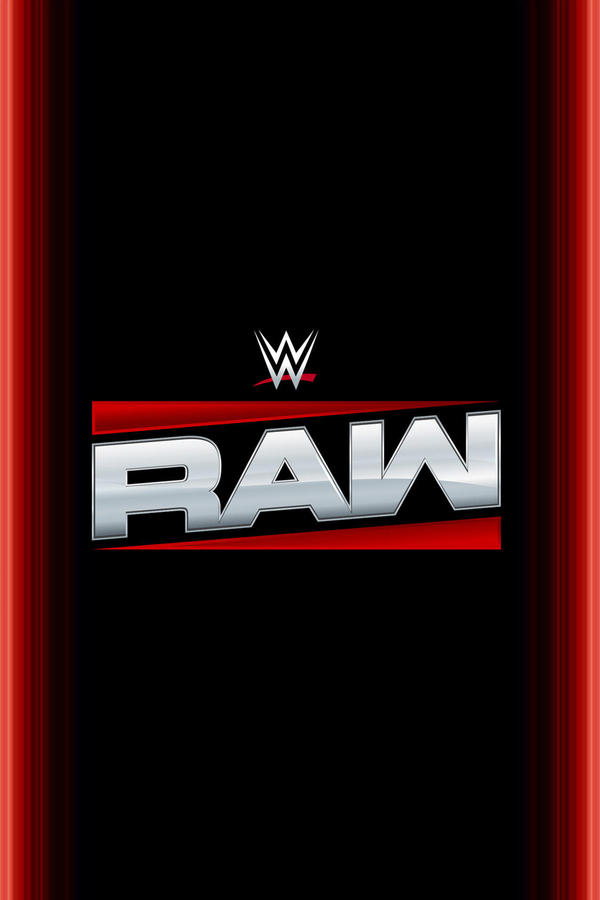
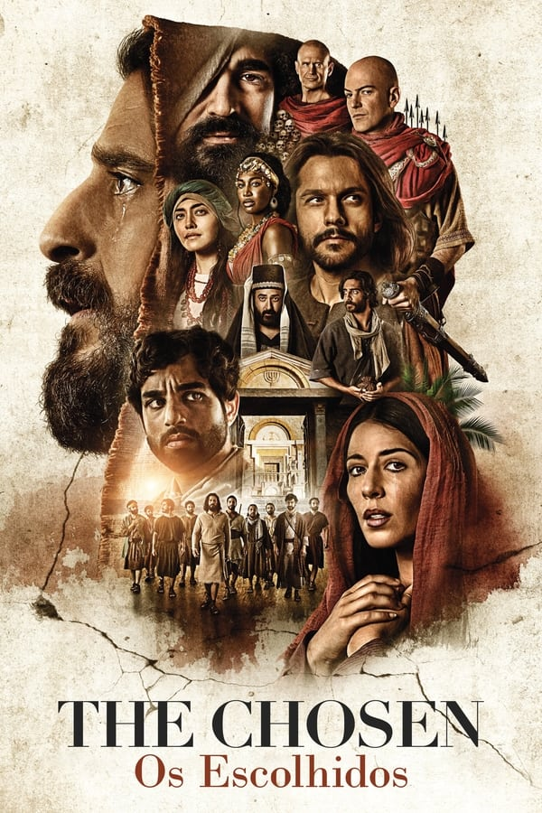
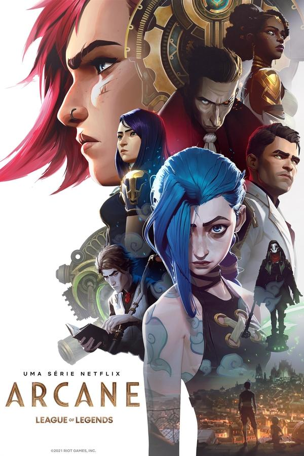
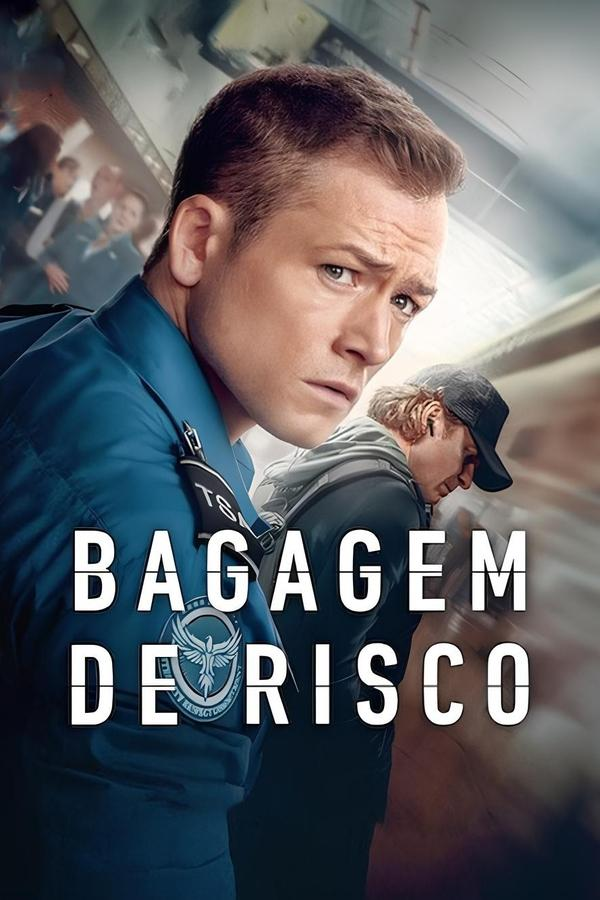
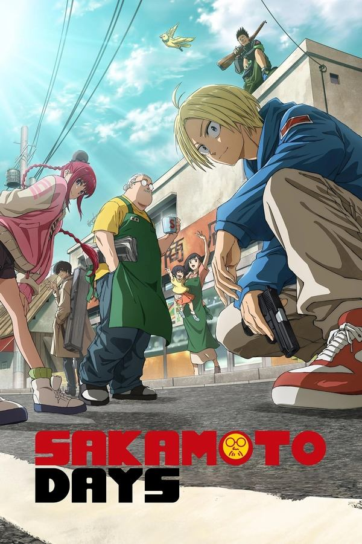
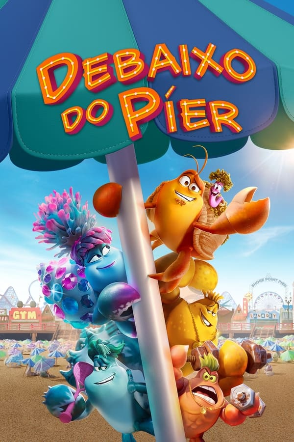
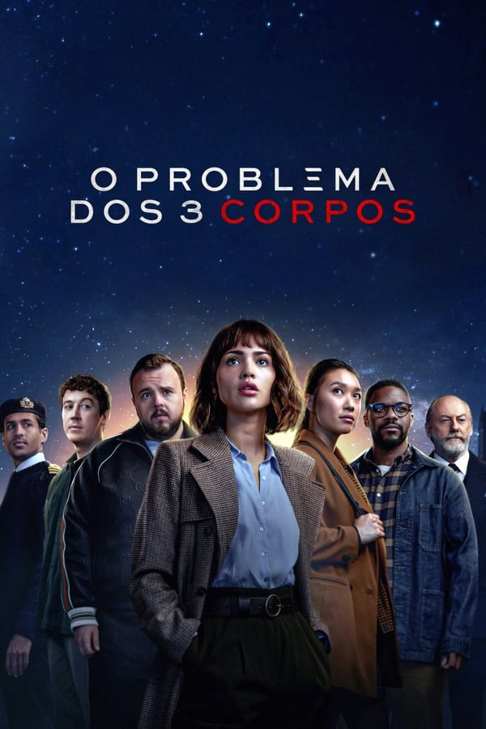
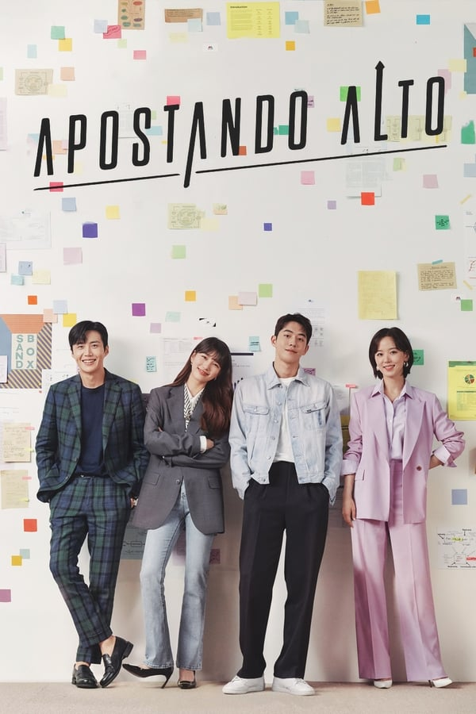

# 🎬🎞️ Netflix Clone 🎬🎞️

Este projeto é um clone da interface da Netflix, desenvolvido com **HTML**, **CSS** e **JavaScript**. O objetivo é aprimorar habilidades em **layout responsivo**, **carrossel de imagens** e **design moderno**. O projeto se destaca pela sua responsividade, garantindo que a interface se adapte corretamente a telas pequenas, médias e grandes. Além disso, a navegação é intuitiva, com um menu fixo, botões para interações rápidas e um banner principal promovendo um título em destaque.

## 🚀 Tecnologias Utilizadas

- **HTML5**: Estrutura do projeto.
- **CSS3**: Estilização e responsividade.
- **JavaScript**: Interatividade e lógica do carrossel.
- **[Owl Carousel](https://owlcarousel2.github.io/OwlCarousel2/)**: Biblioteca para criação do carrossel de filmes.
- **[FontAwesome](https://fontawesome.com/)**: Ícones utilizados nos botões.

## 📌 Funcionalidades

✔️ Interface semelhante à Netflix.<br>
✔️ Carrossel de filmes dinâmico.<br>
✔️ Responsividade para diversos dispositivos.<br>
✔️ Estilização moderna utilizando CSS.<br>
✔️ Botões interativos.

## 📁 Estrutura do Projeto

```bash
📦 netflix-clone
├── 📂 img                # Imagens do projeto
├── 📂 js                 # Scripts JavaScript
│   ├── jquery.min.js     # Biblioteca jQuery
│   ├── owl.carousel.min.js  # Biblioteca Owl Carousel
│   ├── setup.js          # Configuração do carrossel
├── 📂 style              # Arquivos de estilo
│   ├── main.css          # Estilos principais
│   ├── responsive.css    # Estilos responsivos
│   ├── owl.carousel.min.css  # Estilos do carrossel
│   ├── owl.theme.default.min.css # Tema do carrossel
├── index.html            # Página principal
└── README.md             # Documentação do projeto
```

## 📜 Código Principal

### 🔹 HTML
```html
<!DOCTYPE html>
<html lang="en">
<head>
    <meta charset="UTF-8">
    <meta name="viewport" content="width= , initial-scale=1.0">
    <link rel="stylesheet" href="style/main.css">

    <!--Resposividade-->
    <link rel="stylesheet" href="style/responsive.css">

    <!--owl css-->
    <link rel="stylesheet" href="style/owl/owl.carousel.min.css">
    <link rel="stylesheet" href="style/owl/owl.theme.default.min.css">

    <title>NETFLIX CLONE</title>
</head>
<body>
    <header>
        <div class="container">
            <h2 class="logo">NETFLIX</h2>
            <nav>
                <a href="#">Início</a>
                <a href="#">Série</a>
                <a href="#">Filmes</a>
                <a href="#">Documentários</a>
            </nav>
        </div>
    </header>

    <main>
        <div class="filme-principal">
            <div class="container">
                <h3 class="titulo">ROUND 6</h3>
                <p class="descricao">Centenas de jogadores falidos aceitam um estranho convite para um jogo de sobrevivência. Um prêmio milionário aguarda, mas as apostas são altas e mortais. Assista agora a nova temporada de Round 6 que está imperdível</p>
                <div class="botoes">
                    <button role="button" class="botao">
                        <i class="fa-solid fa-play"></i>
                        ASSISTIR AGORA
                    </button>
                    <button role="button" class="botao">
                        <i class="fa-solid fa-circle-info"></i>
                        MAIS INFORMAÇÕES
                    </button>
                </div>
            </div>
        </div>
    </main>


    <div class="carrosel-filmes">
        <div class="owl-carousel owl-theme">
            <div class="item">
                
            </div>
            <div class="item">
                
            </div>
            <div class="item">
                
            </div>
            <div class="item">
                
            </div>
            <div class="item">
                
            </div>
            <div class="item">
                
            </div>
            <div class="item">
                
            </div>
            <div class="item">
                
            </div>
            <div class="item">
                
            </div>
            <div class="item">
                
            </div>
        </div>
    </div>


    <script src="https://kit.fontawesome.com/dcd2795583.js" crossorigin="anonymous"></script>
    <script src="js/owl/jquery.min.js"></script>
    <script src="js/owl/owl.carousel.min.js"></script>
    <script src="js/owl/setup.js"></script>

</body> 
</html>
```

### 🔹 JavaScript (Configuração do Carrossel)
```js
$('.owl-carousel').owlCarousel({
    loop:true,
    margin:10,
    nav:false,
    responsive:{
        0:{
            items:1
        },
        600:{
            items:3
        },
        1000:{
            items:5
        }
    }
})
```

## 🎨 Estilização (CSS Principal)
```css
:root{ 
    --vermelho: #E50914;
    --preta:  #141414;
}

*{
    margin: 0;
    padding: 0;
    box-sizing: border-box;
}

/*elementos base*/
body{
    background: var(--preta);
    font-family: 'Arial', Times, serif;
    color: white;
}

header .container{
    display: flex;
    flex-direction: row;
    align-items: center;
    justify-content: space-between;
}
    
header .logo{
    margin-left: 5px;
    color: var(--vermelho);
    font-family: 'Arial Black', Times;
    font-size:40px;
}


header nav a{
    text-decoration:none;
    color: #AAA;
    margin-right: 10px;
}

header nav a:hover{
    color: #ffff;
}

/*filme principal*/
.filme-principal{
    font-size: 16px;
    background: linear-gradient(rgba(0,0,0,.50), rgba(0,0,0,.50)100%), url('/img/round-6-imag-fundo.jpg');

    height: 400px;
    background-size: cover;

    display: flex;
    flex-direction: column;
    justify-content: center;
    align-items: flex-start;
}

.filme-principal .descricao{
    margin-top: 10px;
    margin-bottom: 40px;
}

.filme-principal .titulo{
    margin-top: 15%;
    font-size: 40px;
    font-family: 'Trebuchet MS', Arial, sans-serif;
}

.botao{
    background-color: rgba(0,0,0, .50);
    border: none;
    color: white;


    padding: 15px 30px;
    margin-right: 15px;
    font-size: 12px;

    cursor: pointer;
    transition: .3s ease all;
}

.botao:hover{
    background-color: white;
    color: black;
}

.botao i{
    margin-right: 5px;
}

.container{
    margin-left: 20px; /*Aqui estamos modificando todos os elementos que estão dentros de todos os 'containers'*/
}

.filme-principal .container{
    width: 70%; /*Aqui estamos modificando somente o container do 'filme-principal'*/
}

.box-filme{
    height: 100%;
    width: 100%;
    display: block;
}

.carrosel-filmes{
    margin-top: 5px;
}
```

## 📱 Media Queries (Responsividade)
```css
@media screen and (max-width: 700px){
    header .container{
        display: flex;
        flex-direction: column;
    }

    .botao{
        margin-top: 5px;
        width: 190px;
    }
}

@media screen and (min-width: 1000px){
    .descricao{
        width: 50%;
    }
}
```

## 🔗 Links e Recursos

- [Owl Carousel](https://owlcarousel2.github.io/OwlCarousel2/) - Biblioteca utilizada para o carrossel.
- [FontAwesome](https://fontawesome.com/) - Ícones utilizados no projeto.
- [Documentação Oficial do jQuery](https://jquery.com/) - Biblioteca JavaScript utilizada.

## 📌 Como Executar o Projeto

1. **Clone o repositório:**
   ```bash
   git clone https://github.com/seu-usuario/netflix-clone.git
   ```
2. **Abra o arquivo `index.html` no navegador.**
3. **Para modificar, edite os arquivos CSS e JS conforme necessário.**

## 📜 Licença

Este projeto foi desenvolvido apenas para fins educacionais e não tem qualquer vínculo com a Netflix. Use livremente para aprendizado!

---

Feito com ❤️ por Hélio Junior 🚀
